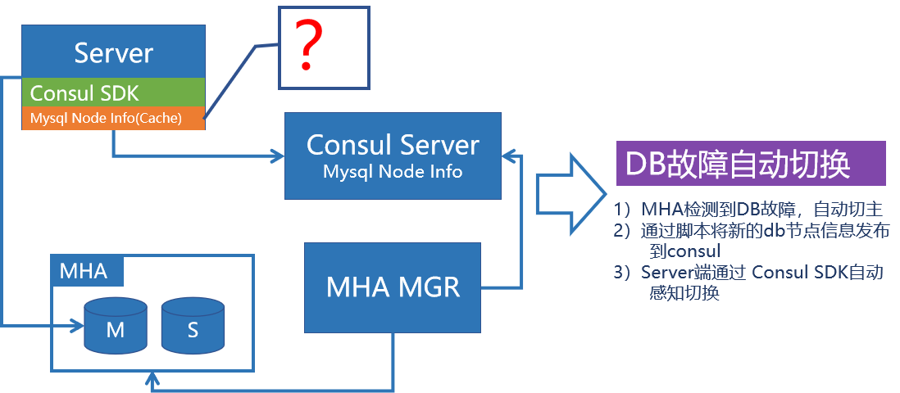

# 高可用架构实践分享

## Part.1 高可用的度量

高可用（High Availability）指系统无中断执行其功能的能力，代表系统的可用性程度。我们通常用SLA(service level agreement)来测量服务的可用性，也就是几个9的可用性。

| **可用性水平** | **宕机时间/年** | **宕机时间/月** | **宕机时间/天** |
| -------------- | --------------- | --------------- | --------------- |
| 99%            | 3.65 天         | 7.20 小时       | 14.4 分         |
| 99.9%          | 8.76 小时       | 43.8 分         | 1.44 分         |
| 99.99%         | 52.56 分        | 4.38 分         | 8.66 秒         |
| 99.999%        | 5.26分          | 25.9 秒         | 0.87 秒         |

要谈可用性，首先必须承认所有的东西都有不可用的时候，只是程度不同而已。在我们的观念里面一个服务至少要做到99.9%才称为基本可用，是合格的产品。

然而，3个9意味着每年宕机8.76小时，这个对于互联网公司是否足够呢？

> 假设某公司每个小时营收100w，服务可用性99.9%年受损=8.76*100w=**876**w

以上面的case来讲，3个9显然是不够的。但是不是可用性越高越好呢，从服务的质量上来讲，9越多，服务越稳定，不可用时长越短，系统因不可用造成的损失就越少，但是从投入的的维度来讲，可用越高，前期研发投入成本越高。

在可用性带来的收益和投入资产之间有一个平衡点，找到这个平衡点才能收益最大化。也只有先确定了这个点，才能设计出有效的容灾方案。

99%、99.9%基本是可以靠运气搞定，3个9可以靠堆人，强制值班人为处理基本可以搞定，但是3个9以上，基本上就超出了人力的范畴，考验的是系统的自愈能力，架构的容灾、容错设计，灾备系统的完善等等。

## Part.1 高可用架构的设计

高可用是一个比较复杂的命题，在所有的处理中都会涉及到高可用。在大的层面我们可以分为服务的高可用和数据存储的高可用。

### 应用服务的高可用

在应用服务高可用上面，我们有服务隔离、服务监控、服务分流、负载均衡、服务冗余、服务降级、服务限流、幂等重试、柔性化/异步化、服务熔断等手段。

这里我们仅从幂等重试、柔性化/(异步化)、服务熔断几个层面上来讨论服务高可用。

#### 1)幂等重试

##### 重试是救命稻草

Retry模式能够处理调用远端服务或者网络资源的时候发生的一些可以**预期的临时性**的错误。通过重试，我们能让请求获得一次重放的机会，是服务可用性的救命稻草。在实际的应用中，我们很有可能仅仅通过重试就能将服务的可用性提升一个数量级。

重试听起来好像很有吸引力，但重试并非万能，重试主要解决的问题是调用远端服务或者资源发生的一些可以预期的临时性的错误。这里有两个非常重要的点，预期的、临时性的，这意味着非预期的，或者非临时性的我们不能盲目重试。

重试可以极大的提高系统的可用性，但是重试是有前提的，下面列出的一些场景就不可以盲目重试。

1. 长时间持续的错误
2. 因请求量过大引起的异常
3. 具体业务引起的内部异常
4. 
   非**幂等**请求，不要重试

重试在有些不当的场景下，有时候不但不能提升系统可用性，反而会引起更糟糕的结果，比如第2种场景，盲目重试只能会给下游系统造成更大的压力。除了需要规避一些不能重试的场景之外，重试还有一些常见的策略。选择合适的策略可以提升重试的成功率，降低重试的副作用。

- TimeoutRetryPolicy
- CircuitBreakerRetryPolicy
- CompositeRetryPolicy
- BackOffPolicy（退避策略）

##### 幂等是合格架构师的基因

提到重试，不能不提幂等，幂等是重试的前提。所谓的幂等(idempotent)是指任意多次执行操作所产生的影响均与一次执行的影响相同，概念来自高等代数。

> 如果满足f(x)=f(f(x)), x为某集合内的任意数, f为运算子，那么我们称f运算为具有幂等性

如果不幂等，则说明`f(x)≠f(f(x))`，这意味着一个函数执行两次的结果是不一样的，在接口层面上来讲，一个请求执行两次的影响不同，也就说一个请求被重试后，可能会造成不同的结果。

我们通常通过生成一个唯一id标志请求，并且将请求的和请求返回的结果来记录到db来实现幂等。然而大规模的系统幂等在工程上也并非一件容易的事情，尤其是分布式的系统。关于幂等的实现详见：[大规模分布式系统幂等组件的设计](https://github.com/zhizus/share/blob/master/2019-07-29%E5%A4%A7%E8%A7%84%E6%A8%A1%E5%88%86%E5%B8%83%E5%BC%8F%E7%B3%BB%E7%BB%9F%E5%B9%82%E7%AD%89%E7%BB%84%E4%BB%B6%E8%AE%BE%E8%AE%A1.md)

#### 2)柔性化/异步化

#### 3）服务熔断

### 数据存储的高可用

#### Mysql MHA+Consul

#### Mysql MHA+Consul（网络分区）？

#### Mysql MHA+Consul-孤岛熔断 

## 定损+止损

####  完美的解决方案

## Part.2 大规模系统的高可用

大规模系统下的困难

Part.2 高可用的影响因子

> Avaliability = f ( MTBF, MTTR )
>
> MTBF: Mean time between Failures(平均故障间隔)
>
> MTTR: Mean Time To Restoration(平均恢复时间)

## Part.2 常见的故障画像

## Part.2 高可用方法论

| **不可用因素** | **典型做法**                   | **MTBF**         | **MTTR**                         | **平台**                        |
| :------------- | ------------------------------ | ---------------- | -------------------------------- | ------------------------------- |
| 研发质量       | Sonar、CR、开发规范、方案提审  | 减少bug          |                                  | 规范+持续集成平台               |
| 测试质量       | 单元测试、集成测试、自动化测试 | 提前发现bug      |                                  | 持续集成平台                    |
| 发布管理       | 精准流量控制的发布系统         | 精准灰度发布     | 一键回滚                         | rms发布平台+Service Mesh        |
| 监控告警       | 服务侧监控，应用侧监控         |                  | 发现问题，及时处理，减少故障时长 | Cat、Zipkin、APM                |
| 系统稳定性     | 针对系统风险项，逐一优化       |                  |                                  | 灾备风险表                      |
| 机器机房故障   | 消除单点，多机房容灾           | 异地容灾+ack机制 | 故障快速切换                     | 容灾专项                        |
| 容量规划       | 链路压测                       | 及时发现系统问题 |                                  | tcpcopy jmeter （Service Mesh） |
| 故障预案       | 定损和止损预案                 |                  | 一键熔断降级                     | Service Mesh                    |
| 故障演练       | 模拟应用各种异常场景           | 提前发现容灾问题 |                                  | 故障演练系统（Service Mesh）    |

## 参考文档