# 高可用架构的实践

[关键词]高可用、大规模、MHA、一致性、方法论

[摘要]高可用（`High Availability`）指系统无中断执行其功能的能力，代表系统的可用性程度。要解决系统的可用性问题是一个比较复杂的命题，本文结合自己在时间过程中总结的经验，从单应用系统的可用性和大规模系统的可用性两个层面探讨高可用问题。包括对金融容灾余额扣减容灾方案的探讨和大规模容灾的经验总结。

## 1 高可用的度量

高可用（High Availability）指系统无中断执行其功能的能力，代表系统的可用性程度。我们通常用SLA(service level agreement)来测量服务的可用性，也就是几个9的可用性。

| **可用性水平** | **宕机时间/年** | **宕机时间/月** | **宕机时间/天** |
| -------------- | --------------- | --------------- | --------------- |
| 99%            | 3.65 天         | 7.20 小时       | 14.4 分         |
| 99.9%          | 8.76 小时       | 43.8 分         | 1.44 分         |
| 99.99%         | 52.56 分        | 4.38 分         | 8.66 秒         |
| 99.999%        | 5.26分          | 25.9 秒         | 0.87 秒         |

要谈可用性，首先必须承认所有的东西都有不可用的时候，只是程度不同而已。在我们的观念里面一个服务至少要做到99.9%才称为基本可用，是合格的产品。

然而，3个9意味着每年宕机8.76小时，这个对于互联网公司是否足够呢？

> 假设某公司每个小时营收100w，服务可用性99.9%年受损=8.76*100w=**876**w

以上面的案例来讲，3个9显然是不够的。但是不是可用性越高越好呢，从服务的质量上来讲，9越多，服务越稳定，不可用时长越短，系统因不可用造成的损失就越少，但是从投入的的维度来讲，可用越高，前期研发投入成本越高。

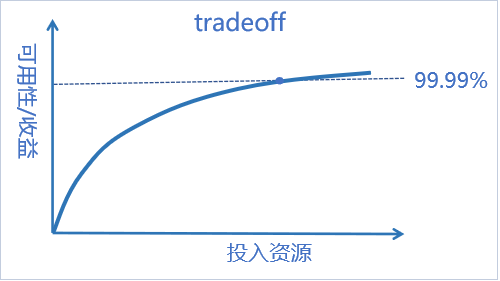

在可用性带来的收益和投入资产之间有一个平衡点，找到这个平衡点才能收益最大化。也只有先确定了这个点，才能设计出有效的容灾方案。

99%、99.9%基本是可以靠运气搞定，3个9可以靠堆人，强制值班人为处理基本可以搞定，但是3个9以上，基本上就超出了人力的范畴，考验的是系统的自愈能力，架构的容灾、容错设计，灾备系统的完善等等。

## 2 高可用架构的设计

高可用是一个比较复杂的命题，在所有的处理中都会涉及到高可用。在系统的维度我们可以分为应用服务的高可用和数据存储的高可用，应用的高可用侧重于应用层的稳定性，而数据存储层的高可用则侧重于冗余。下面会从**应用服务的高可用**和**数据存储的高可用**两个方面来讨论高可用架构设计。

### 2.1应用服务的高可用

在应用服务高可用上面，我们有服务隔离、服务监控、服务分流、负载均衡、服务冗余、服务降级、服务限流、幂等重试、柔性化/异步化、服务熔断等手段。

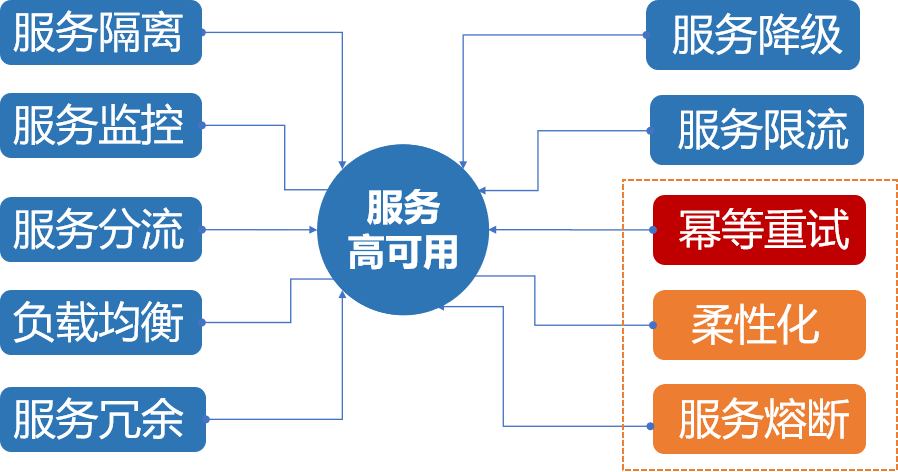

这里我们仅从幂等重试、柔性化/(异步化)、服务熔断几个层面上来讨论服务高可用。

#### 2.1.1幂等重试

##### 2.1.1.1 重试是救命稻草

Retry模式能够处理调用远端服务或者网络资源的时候发生的一些可以**预期的临时性**的错误。通过重试，我们能让请求获得一次重放的机会，是服务可用性的救命稻草。在实际的应用中，我们很有可能仅仅通过重试就能将服务的可用性提升一个数量级。

重试听起来好像很有吸引力，但重试并非万能，重试主要解决的问题是调用远端服务或者资源发生的一些可以预期的临时性的错误。这里有两个非常重要的点，预期的、临时性的，这意味着非预期的，或者非临时性的我们不能盲目重试。

重试可以极大的提高系统的可用性，但是重试是有前提的，下面列出的一些场景就不可以盲目重试。

1. 长时间持续的错误
2. 因请求量过大引起的异常
3. 具体业务引起的内部异常
4. 
   非**幂等**请求，不要重试

重试在有些不当的场景下，有时候不但不能提升系统可用性，反而会引起更糟糕的结果，比如第2种场景，盲目重试只能会给下游系统造成更大的压力。除了需要规避一些不能重试的场景之外，重试还有一些常见的策略。选择合适的策略可以提升重试的成功率，降低重试的副作用。

##### 2.1.1.2幂等是合格架构师的基因

提到重试，不能不提幂等，幂等是重试的前提。所谓的幂等(idempotent)是指任意多次执行操作所产生的影响均与一次执行的影响相同，概念来自高等代数。

> 如果满足f(x)=f(f(x)), x为某集合内的任意数, f为运算子，那么我们称f运算为具有幂等性

如果不幂等，则说明`f(x)≠f(f(x))`，这意味着一个函数执行两次的结果是不一样的，在接口层面上来讲，一个请求执行两次的影响不同，也就说一个请求被重试后，可能会造成不同的结果。

我们通常通过生成一个唯一id标志请求，并且将请求的和请求返回的结果来记录到db来实现幂等。然而大规模的系统幂等在工程上也并非一件容易的事情，尤其是分布式的系统。关于幂等的实现详见：[大规模分布式系统幂等组件的设计](https://github.com/zhizus/share/blob/master/2019-07-29%E5%A4%A7%E8%A7%84%E6%A8%A1%E5%88%86%E5%B8%83%E5%BC%8F%E7%B3%BB%E7%BB%9F%E5%B9%82%E7%AD%89%E7%BB%84%E4%BB%B6%E8%AE%BE%E8%AE%A1.md)

#### 2.1.2柔性化/异步化

所谓的柔性化，就是在我们业务中允许的情况下，做不到给予用户百分百可用的，通过降级的手段给到用户尽可能多的服务，而不是非得每次都交出去要么 100 分或 0 分的答卷。面对着如此多的不确定性，我们希望我们的应用本身能够具有一些『柔性』的特征，使得在面对不确定的场景突然出现时，应用仍能够承受这些变化。

怎么去做柔性化，更多其实是对业务的理解和判断，柔性化更多是一种思维，需要对业务场景有深入的了解。

例如，送礼支付完成后，会有主播分成和公会分成以及累计送礼榜单等等一系列操作，理论上送礼后产生的行为动作不能影响核心送礼的稳定性。通过将送礼后的流程异步化，从而保证系统柔性可用。

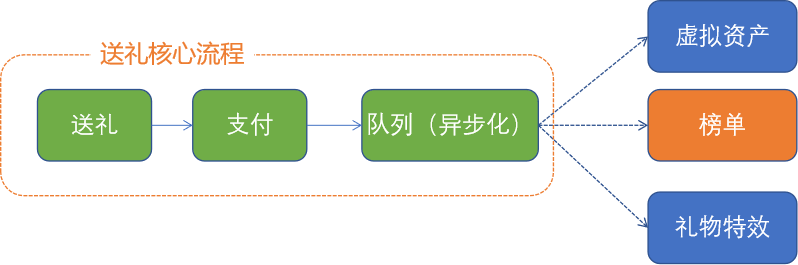

#### 2.1.3服务熔断

**服务熔断是一种及时止损，自我保护的机制**。服务熔断类似家里的电路熔断，如果家里的电路发生短路，熔断器能够主动熔断电路，以避免灾难性损失。在分布式系统中应用电路熔断器模式后，当目标服务慢或者大量超时，调用方能够主动熔断，以防止服务被进一步拖垮；如果情况又好转了，电路又能自动恢复，这就是所谓的弹性容错，系统有自恢复能力。下图是一个典型的具备弹性恢复能力的电路保护器状态图，正常状态下，电路处于关闭状态(Closed)，如果调用持续出错或者超时，电路被打开进入熔断状态(Open)，后续一段时间内的所有调用都会被拒绝(Fail Fast)，一段时间以后，保护器会尝试进入半熔断状态(Half-Open)，允许少量请求进来尝试，如果调用仍然失败，则回到熔断状态，如果调用成功，则回到电路闭合状态。

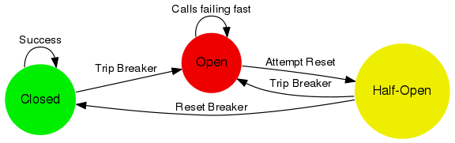

很多时候刚开始可能只是系统出现了局部的、小规模的故障，然而由于种种原因，故障影响的范围越来越大，最终导致了全局性的后果。**为防止造成整个系统故障，从而采用的一种保护措施，所以很多地方把熔断亦称为过载保护**。

需要阻止应用不断尝试调用远端服务或者访问共享资源，并且这些请求很容易失败的时候使用`Circuit-Breaker`模式很合适。当用来处理访问本地资源，比如内存中的数据结构的时候，不适合使用。在这种场景下，`Circuit-Breaker`只会给应用带来额外的负担。 将`Circuit-Breaker`作为处理应用中的业务逻辑中的异常处理的一部分也是不合适的。

### 2.2.数据存储的高可用

高可用的核心议题是**冗余**和**故障转移**，在冗余和故障转移保证数据一致性不是一件容易的事情，这也是数据存储高可用要面临的难题。下面我们以mysql为背景，来探讨数据存储的高可用。

#### 2.2.1《Mysql MHA+Consul》故障自动切换方案

主从复制是Mysql最常见也是最简单的高可用方案之一，但是Mysql主从结构仅解决了数据冗余，没有解决故障转移的问题和主从节点信息发布的问题。

**MHA（Master High Availability）**是一个相对比较成熟的高可用切换方案。简单的来说它一套mysql故障检测和故障转移的脚本。能保证在0~30S内完成故障的切换操作，并且在切换的过程中，最大程度的保证数据一致性。

**Consu**l可以用来作为服务发现，配置中心，实现了分布式一致性协议（Raft协议），这里我们主要是用来发布Mysql的主从节点信息状态。Server端通过sdk获取最新的节点信息。

我们也是通过Mysql MHA +Consul来实现了Mysql故障自动切换，如下图所示。

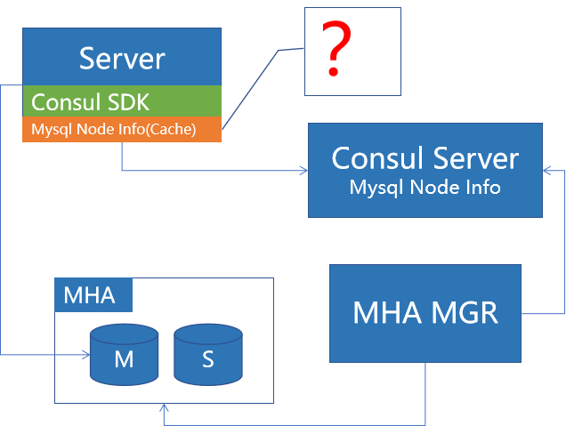

这个解决方案的核心还是MHA，MHA方案有两个关键点，一个是0-30s完成切换，这个是很重要的，通过这个信息我们能知道最坏的情况，可以对极端情况做一些预案，我们在后面的演练中，效果都比这个要理想，正常kill db演练，整个切换基本在1~2s就完成了。另一个是故障切换过程中，MHA能最大程度的保证数据一致性。这句说携带了两个信息，一个是说MHA能最大程度保证数据一致性，反过来说，MHA不能做到完全一致。

那么下面我就来讲讲MHA故障切换过程，看它是怎样最大程度保证数据一致性的。

##### **MHA正常切换过程：**

1）MHA检测到DB故障，MHA先将主库禁写（尽可能保证主从数据一致），

2）主从同步完成（主节点宕机的场景，MHA会通过脚本将binlog拷贝过来完成同步），自动切主

3）通过脚本将新的db节点信息发布到consul

4）Server端通过 Consul SDK自动感知切换

异常场景下，如果主节点的服务网络也不通，无法保证切换之前主从数据一致，如果从数据一致性维度考虑，我们可以选择切换失败，让业务受损。如果从可用性的维度考虑，我们可以选择MHA强制切换，牺牲一致性来提供服务。

至于可用性和一致性之间怎么选择，这里提供一个选择的维度，从公司受损的维度来选择。这里涉及到一个比较关键问题就是如何定义损失。

##### 定损+止损

> 我们以一个底层的消费系统为例，假设消费系统1小时的营收流水100w，

MHA自动切换预估损失低于1k

> MHA故障切换时间15s内，15s营收4k左右，存在超扣且不能被追回的预计不到四分之一，故障切换损失低于1k

人工手动切换预估损失30w+

> 人工响应时间+人工追回数据时间大于20min

从公司故障受损的维度来看，MHA故障自动切换造成一致性所带来的的损失远低于服务不可用造成的损失。

【注】说完MHA的切换过程，细心的同学可能会发现MHA的切换非常依赖Mysql的主从binlog同步，主从同步延时越小，那么切换越简单，越快。mysql 5.7的binlog复制真正实现了多线程并行复制，那其实新接入MHA的系统建议mysql版本升级到5.7。

#### 2.2.2《Mysql MHA+Consul》网络分区下的脑裂问题

《Mysql MHA+Consul》网络分区的场景下会发生什么呢，接下来我们讨论以下网络分区的场景：
假设bj机房网络孤岛，当前mysql主节点正好在bj机房，，这个时候mha mgr检测到bj机房主节点不通，认为主节点宕机，触发自动切换主节点，这个时候gz机房会产生新的主节点，由于bj机房是网络孤岛，consul SDK必然会拉取不到最新的db节点信息，也就意味着这时候bj机房内部是完全不知道新的主节点，如果bj机房还有外网流量进来，这时候就会有两个机房同时写两个不同的主节点，这是典型的脑裂的场景，对于金融业务，脑裂的场景是及其危险的，会出现超扣的风险。

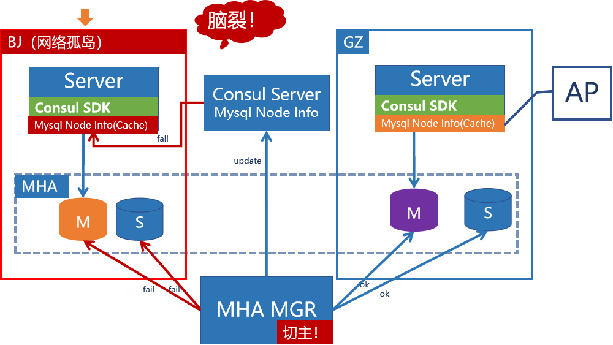

我们还是回到刚才的那个mysql node cache上面来，因为出现脑裂的关键点在于这份缓存，在cap理论中，这个缓存相当于把一个cp的系统编程了一个ap的系统。所以怎么解决这个问题，貌似已经很简单了。去掉这层缓存就可以了。我们刚才也讲到了，consul实现了分布式一致性协议raft，那么至少可以保证各个节点要么拿不到值，要么拿到的值都是相同的。

这样确实能解决脑裂的问题，但是我们在单边机房出现问题的时候，可能会引起整个系统不可用，这个也是我们不想看到的。

#### 2.2.3 《Mysql MHA+Consul》孤岛熔断解决脑裂问题

那我们整理一下我们的需求，我们不要脑裂，但是我们要尽可能高的可用性，我们只需要针对脑裂的场景让服务拒绝服务，从而保证数据一致性不被破坏。

**识别网络分区（脑裂）的场景：**

1）通过consul的Raft协议识别网络分区的场景

2）业务侧实现double check剔除因为网络抖动造成网络分区的误判。

**网络分区（脑裂）场景下熔断余额扣减类型业务**

1）业务侧实现拦截器，网络分区场景下直接返回特定返回码

2）前端识别到特定的状态码，进行跨机房重试，提高系统可用性

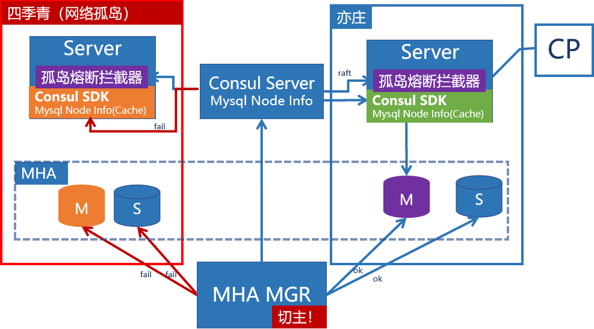

比刚才的方案多了一个拦截器，拦截器做了什么呢，拦截器检测孤岛的场景，然后熔断服务（抛出5XX，前端跨机房重试），我们保留了cache，加了一个拦截器，把孤岛的场景剔除。前面讲到consul实现了raft协议，那么将consul和应用平行部署，然后以来consul识别网络孤岛就好了。但是我们知道啊，故障检测都怕网络抖动，网络抖动误判就会造成服务的不可用，这个也是我们不想看到的，怎么办，继续识别出来剔除，所以拦截器里面额外多了一点逻辑，通过ping另外机房的应用节点，做了一次孤岛场景的double check，后来我们应用的时候，发现consul确实会有一些误判，但是都成功被这个double check机制给拦截掉了。

####  2.2.4 《Raft+Mysql binlog》完美的解决方案？

《Mysql MHA+Consul》这个方案中，尽管我们解决了我们的问题，但是我们花费了大量的精力去论证解决可用性和一致性的取舍问题，最后我们还是要以承担一定代价来实现故障自动转移。

有没有一个完美的方案能让一致性和可用性兼得呢？

有，但是要满足两者我们必须实现一个分布式一致性协议的存储。世界上目前已知的经过理论证明和实际检验的一致性算法屈指可数：两阶段提交two-phase commit (2PC)、Paxos[4]、Raft[5]、Zookeeper Atomic Broadcast (ZAB)[3]、Viewstamped Replication[5]等。2PC虽然可以保证一致性，但在主机故障时无法工作，存在可用性问题。目前被工业界广泛认可和应用的是Paxos和Raft。

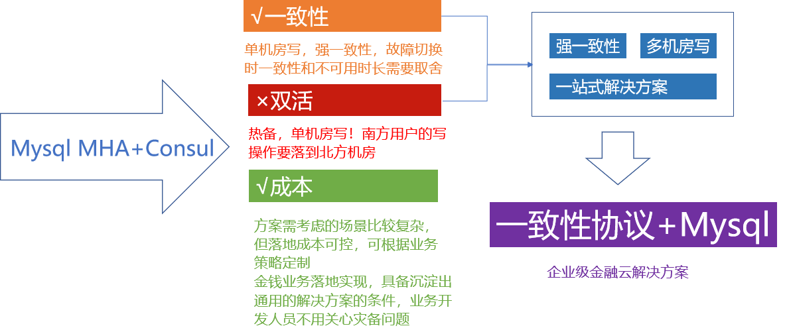

考虑到Paxos工程化的难度考虑，我们选择基于`Raft`协议来实现分布式存储。同时为了兼容我们现有的Mysql，我们需要在Mysql的基础上面应用Raft协议。我们需要将binlog的存储改造成实现了Raft协议基于binlog的分布式存储。（微信已经有在Mysql上应用paxos协议的成功经验，详见：[A high availability MySQL cluster that guarantees data consistency between a master and slaves.](https://github.com/Tencent/phxsql)）

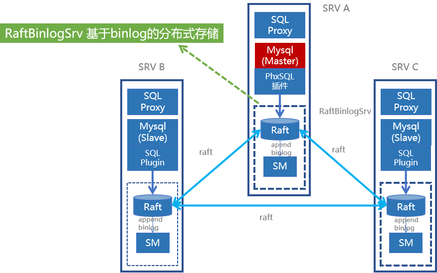

#### 2.2.5 《Raft+Mysql binlog》的局限性

在不完美的世界，完美是不存在的。尽管通过《Raft+Mysql binlog》既满足了强一致性又满足了解决的可用性的问题，但是也存在如下局限性：
1）**MySQL主机在执行SQL DDL命令（例如建库和建表命令）时可能存在一致性风险。**

由于MySQL的innodb引擎不支持DDL回滚，如果主机在innodb已经commit这条DDL命令，但是这条命令的binlog还没到达PhxSQL的拦截点前宕机，则这条DDL binlog会在全局binlog中缺失，从而备机也不会收到这条binlog。而为了保证线性一致性、serializable级别事务隔离、及“最小侵入MySQL”原则，我们也不想修改MySQL源码，提前截获DDL命令。考虑到DDL命令频度较低，我们后续准备在PhxSQLProxy加入检查和后续审计告警。也欢迎大家提出更好方案。

2）**在写入请求量很大的系统中，MySQL备机流水可能落后较多；如果这个时候主机死机，备机暂时无法提升成新主机，造成系统在一段时间内不可写。**

为了保证线性一致性，对于要求读取最新数据的请求（通过ReadWritePort发起的读请求）也将失败；需要等至少一台备机追完流水，被提升为主机才能响应读取最新数据的请求。对于不需要读取最新数据的请求（通过ReadonlyPort发起的请求），可以从任意备机执行，但不保证线性一致性。（注意：PhxSQL保证无论MySQL主机流水领先MySQL备机多少，MySQL主机binlog流水和全局binlog流水是一致的，不会导致数据丢失和破坏线性一致性。）

MySQL备机追流水落后是基于binlog复制这种模式的一个潜在问题。事实上，不仅MySQL主备，任何一个多副本系统，只要每个写操作不等待所有副本返回，都会出现类似的有些副本落后的问题；而那些等待所有副本返回的模式，在耗时和可用性方面又存在问题。可喜的是MySQL 5.7版本实现了并行复制机制，显著地提高了备机追流水的性能。

除此之外，《Raft+Mysql binlog》方案有这较高的落地成本和维护成本，一般的技术团队难以把控。从成本的角度来考虑，它并不一定是一个最完美的方案。

具体使用什么方案其实是需要根据具体的业务需求和场景来权衡的，架构核心问题是权衡和取舍，架构设计本质也是寻找**当前最优解**，所以方案常常是没有好坏之分，只有是否适合现有的业务场景。

## 3 大规模系统的高可用

`单应用系统高可用`是以一个模块负责人的的视角来思考“如何提升系统可用性？，而`大规模集群的高可用`则是站在更高的层面上来思考“如何提升系统的可用性？看待同一个问题，以两种不同的视角会有迥然不同的结论。

相比单应用的可用性，如下图所示，大规模的系统的可用性有这以下显著的问题：

成百上千的服务，复杂的链路，耦合的依赖而且只有有限资源，不可能说某个系统有坏味道，就会有人力投入重构的，那么面临这些难点，用单应用高可用的思维来解决显然是行不通的。

### 3.1 高可用的影响因子

我们回到最本质的问题上来，要解决可用性的问题，我们首先看看可用性的影响因子。

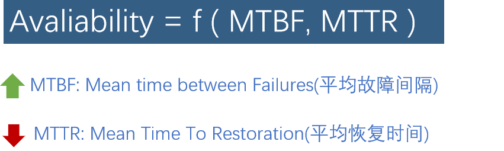

从这个函数可以明显看出高可用跟两个因子有关，一个是MTBF ，一个是MTTR，MTBF 是指平均故障建个时间，MTTR是平均恢复时间，我们要提升系统可用性，只需要提升平均故障间隔，降低平均恢复时间就好了。

回过来接着说说 MTBF 吧。请各位想一下，影响服务MTBF的三大因素！

1. 发布
2. 发布
3. 还是发布！

这个术语上叫 Age Mortality Risk。

一般一个服务只要你不去碰他一年都不会坏一次。更新越频繁，坏的可能性就越大。凡是 Software 都有 BUG，修 BUG 的更新也会引入新的 BUG。发布新版本，新功能是 MTBF 最大的敌人。

从这里我们也不难看出，处理大规模系统的高可用和单应用的高可用思维方式是不同的。要解决大规模系统高可用问题，我们需要根据我们的实际的案例沉淀一套方法论，通过方法论指导我们最有效达成结果。

### 3.2 常见的故障画像

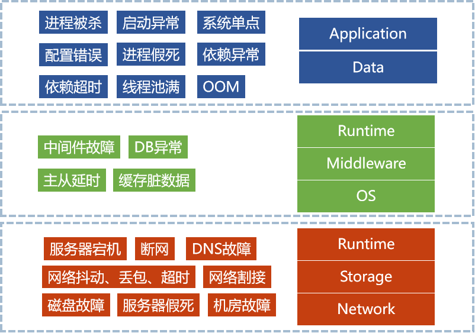

下图将我们常见的故障分为应用层，中间件层和硬件网络层三类，这个上面都是我们的常见的故障，进程被杀，线程池满，依赖超时，OOM 机房割接，网络抖动丢包。降维来看这些常见故障，故障的主要影响因素要包含研发质量、测试质量、流程、监控告警、硬件网络质量等等。

### 3.3 高可用方法论

| **不可用因素** | **典型做法**                   | **MTBF**         | **MTTR**                         | **平台**                        |
| :------------- | ------------------------------ | ---------------- | -------------------------------- | ------------------------------- |
| 研发质量       | Sonar、CR、开发规范、方案提审  | 减少bug          |                                  | 规范+持续集成平台               |
| 测试质量       | 单元测试、集成测试、自动化测试 | 提前发现bug      |                                  | 持续集成平台                    |
| 发布管理       | 精准流量控制的发布系统         | 精准灰度发布     | 一键回滚                         | rms发布平台+Service Mesh        |
| 监控告警       | 服务侧监控，应用侧监控         |                  | 发现问题，及时处理，减少故障时长 | Cat、Zipkin、APM                |
| 系统稳定性     | 针对系统风险项，逐一优化       |                  |                                  | 灾备风险表                      |
| 机器机房故障   | 消除单点，多机房容灾           | 异地容灾+ack机制 | 故障快速切换                     | 容灾专项                        |
| 容量规划       | 链路压测                       | 及时发现系统问题 |                                  | tcpcopy jmeter （Service Mesh） |
| 故障预案       | 定损和止损预案                 |                  | 一键熔断降级                     | Service Mesh                    |
| 故障演练       | 模拟应用各种异常场景           | 提前发现容灾问题 |                                  | 故障演练系统（Service Mesh）    |

*下图为灾备风险表*

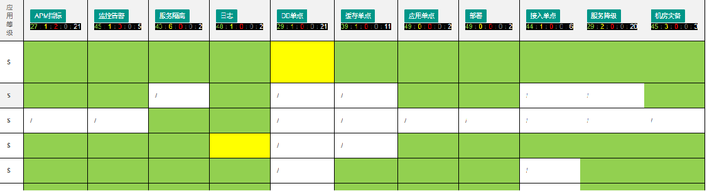

### 3.4 Service Mesh

从上面的方法论里面我们不难看出，很多平台侧的解决方案都会依赖Service Mesh，这个概念刚刚流行起来的时候还有些抵触，那个时候大家都还在落地微服务，有出现一个概念说要把服务分成更细的网格，微服务分的细其实已经有很大的挑战，分隔成更细网格，是不是意味这维护起来会更困难。但是在负责整个业务侧的高可用的时候，我在面临一些具体的场景的时候，发现真正简单粗暴的解决问题的竟然是Service Mesh。
下面我们简单看看Service Mesh,这个我还没有落地经验，担心理解偏差，我就先不讲，如果不了解Service Mesh的先简单把Service Mesh理解为在每个服务侧部署一个透明的代理层，通过这个代理层，我们可以对服务集中的进行控制。

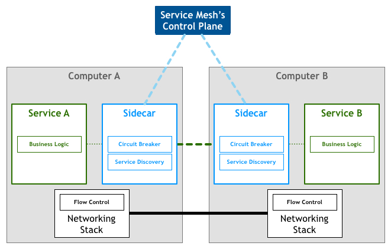
我们看看对服务集中控制可以带来什么:
**1）集中的熔断隔离**
这个很有用，比如前面讲到因为代理重试造成流量放到16倍的案例，如果我们能够做集中的熔断隔离，也不会出现整个站点被拖垮，有的同学肯定在想，不就是熔断，我自己在服务侧前面做个熔断不就好了，不一定非要Service Mesh，确实不一定非要Service Mesh,但是自己做一个却不一定能解决问题，我说说我们的困境。我们有网站端，都是php语言和一些很旧的系统，你自己每个服务做熔断成本高，（php做熔断也很困难，）而且你不一定能覆盖所有的链路。
**2）精准的流量控制**

这个如果我们应用到发布系统，那么研发效率应该能有所提升，我们现在发版，开发是需要比较谨慎的，如果有高效的灰度，发布风险可控，这个很吸引人。
**3）故障模拟演练系统**

现在这个系统我看阿里、去哪相关资料实现的方案基本上都是依赖java asm字节码修改相关的技术来注入指定异常，这个虽然也很不错，实现成本也不低，而且局限于java系统。如果有service Mesh可能不需要那么麻烦，而且能通用。
**4）监控告警**

能够集中控制流量，那么监控告警就是比较简单的问题。

每个层加个代理，就能有对所有的系统的集中控制权限，是服务治理的福音，很多公司都已经在落地Service Mesh，我们尽管拥抱新技术就好了。

## 4 总结

高可用是一个复杂的问题，要解决系统高可用问题，我们可能会面临各种各样的问题。但是高可用核心是冗余和容错，广义的来讲，冗余也可以说是为了容错，从容错的维度也衍生一种设计，`Design for failure`。我们认为可能出错的就一定会出错，网络会丢包，机器会宕机，机房会故障，DNS也会故。只有我们在系统设计的时候能够考虑足够多的不稳定因素，我们才能设计出比较好的高可用架构。

> 只要可能出错，就一定出错——墨菲定律（Murphy’s Law）

## 参考文档

[A high availability MySQL cluster that guarantees data consistency between a master and slaves.](https://github.com/Tencent/phxsql)

[寻找一种易于理解的一致性算法（扩展版）](https://github.com/maemual/raft-zh_cn/blob/master/raft-zh_cn.md)

[谈谈PhxSQL的设计和实现哲学（上）](https://zhuanlan.zhihu.com/p/22345242)

[为了做到微服务的高可用，鬼知道我出了多少张牌](https://mp.weixin.qq.com/s?__biz=MjM5ODI5Njc2MA==&mid=2655825582&idx=1&sn=bb99d9863628ee89a7fa53bd8238f305&chksm=bd74e3798a036a6fb4715d35a524d44ba0926fe19efcdedeaed4b0eafe18d33e7373fa1b9e75&mpshare=1&scene=1&srcid=&sharer_sharetime=1563966802744&sharer_shareid=c04c7e23d84886f1faf3a1cb127522a5&rd2werd=1#wechat_redirect)

[来自 Google 的高可用架构理念与实践](https://mp.weixin.qq.com/s?__biz=MjM5ODI5Njc2MA==&mid=2655825582&idx=1&sn=bb99d9863628ee89a7fa53bd8238f305&chksm=bd74e3798a036a6fb4715d35a524d44ba0926fe19efcdedeaed4b0eafe18d33e7373fa1b9e75&mpshare=1&scene=1&srcid=&sharer_sharetime=1563966802744&sharer_shareid=c04c7e23d84886f1faf3a1cb127522a5&rd2werd=1#wechat_redirect)