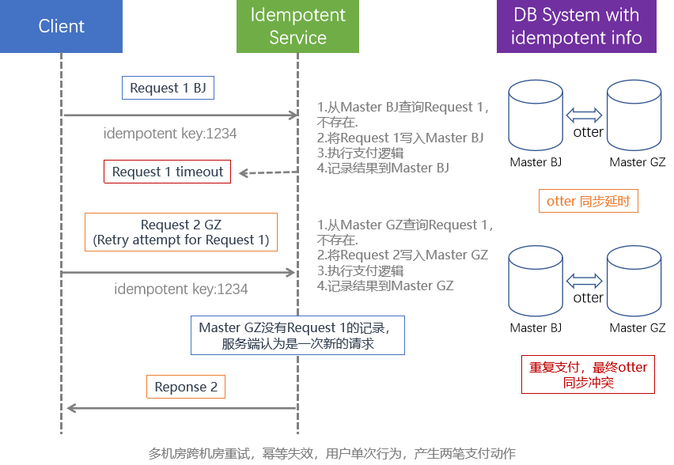

# 大规模分布式系统幂等组件设计

[关键词]幂等、重试、最终一致性、支付系统、跨机房幂等

[摘要]为了保障在大规模的分布式支付系统数据的最终一致性，通常我们需要通过重试来规避一些预期的临时性错误，来保证业务最终正确执行。而重试要求支付系统的各个链路必须提供幂等保障，在大规模的支付系统里实现各个链路节点的幂等保障将会耗费大量的人力成本。抽象通用的幂等组件能有有效的解决这个问题。它在保证系统低时延的同时，还能将幂等的基础实现代码和业务代码分离，提供更好的维护性。基于幂等组件的幂等保障，我们可以通过合适的重试策略，设计出能够自愈的健壮的支付系统。

## 背景

微服务架构在使大型的复杂应用程序可以持续交付和部署的同时也给数据一致性带来的新的挑战，为了保证大规模分布式系统数据的最终一致性，我们通常会通过多次重试来规避不确定的网络坏境的失败，从而确保业务最终一定能够成功执行。然而，重试则可能会导致同一个请求处理多次，在支付业务里则可能会出现更严重的问题，一次请求多次付费，这个对用户来说是难以接受的。

## 幂等的概念

要解决大规模分布式支付系统重试导致多次付费的问题，支付链路上的所有系统节点都需要提供幂等保障。

幂等(idempotent)指任意多次执行操作所产生的影响均与一次执行的影响相同，是来自于高等代数中的概念。

> 如果满足f(x)=f(f(x)), x为某集合内的任意数, f为运算子，那么我们称f运算为具有幂等性

在支付系统中，幂等技术是用来保证同一个支付请求最多被成功执行一次(**at most once delivery** ) ,无论这个请求被重试多少次。

## 现状

- 很多公司在创业时期偏重业务模式的验证，技术上累积的债务较多，导致很多遗留系统幂等支持不是特别好。
- 业务系统在幂等是现实上面没有统一的约束和规范，导致不同的业务人员实现出来的幂等系统质量参差不齐，有些系统在特定场景下，不能保证幂等。
- 多机房容灾提升了系统的可用性，尤其是跨机房重试的策略，可以极大的提高可用性，但却给幂等引入了灾难。跨机房的幂等依赖分布式一致性协议才能保证严格的幂等。绝大多数系统都是依赖副本集来做的多机房容灾，无法保证跨机房幂等。

大规模分布式支付系统中，幂等是一个共性问题，链路上的每一个系统都需要支持幂等保证，每个系统开发人员各自实现一套幂等逻辑，会耗费大量的人力。而幂等的核心的实现逻辑具有业务无关性，所以实现一个通用的幂等方案来让业务开发人员仅关注业务逻辑开发是可行且非常有必要的。

## 幂等方案的选型

要解决大规模分布式支付系统中幂等问题，有两种思路，一种是实现一个幂等的代理层，所有需要支持幂等系统通过RPC调用幂等代理层来获得幂等的能力。另外一种是实现一个通用的幂等的组件，需要支持幂等的系统内置幂等组件来获得幂等的能力。

前者尽管对业务的侵入性较低，但是会引入额外的RPC开销，系统通过RPC调用幂等代理层来获得幂等的能力，意味着链路的长度放大一倍。在大规模的分布式支付系统中，链路层次往往很深，用户请求时延将大幅上涨，另外链路中所有的系统都依赖幂等代理层提供幂等保障，这个代理层很有可能会成为系统的瓶颈。

鉴于支付系统对低时延的要求，我们选择通过实现一个通用的幂等组件来解决大规模分布式系统中的幂等问题。

## 幂等组件设计

实现一个通用的幂等组件来解决大规模分布式支付系统的幂等问题可以保证系统低延时的同时，还能将业务代码和幂等组件基础代码很好的分离。系统的开发人员可以不用关心幂等逻辑的实现，专注了业务逻辑开发，提升研发效率。

我们通常通过将请求和请求返回的结果持久化到幂等信息表中，当相同幂等id的请求重复调用时，我们将可以将之前请求返回的结果返回给用户的方式来实现幂等，基于此我们可以把幂等的主要逻辑抽象为Pre-Idempoent(业务执行前)、Do-BizService(业务执行)、Post-Idempoent(业务执行后)三个阶段。如下图所示：


*【注】当业务成功处理并返回正确的Response，但是幂等后逻辑持久化落盘失败，可能会造成用户下次请求的时候返回不友好的的结果（尽管我们仍然保证了幂等，同一个请求的行为仅执行了一次）。为了提升这种场景下的用户体验 ，我们需要尽可能的让业务逻辑支持幂等，通过重放请求也能拿到正确的Response。*

设计一个通用的幂等组件，首先明确几个非常重要的观点

- 每个幂等请求拥有唯一的幂等的key，相同的请求必须持有相同的幂等的key；
- 请求返回失败的Response需要被标识是否可以重试；
- 幂等需要明确申明时效性，幂等的有效期直接影响到系统的存储空间的使用。
- 幂等的关键问题在于需要通过一个唯一幂等id判断请求是否有被执行过，这个要求存储幂等信息表的存储介质支持强一致性。

#### 幂等的key的选择

关于幂等的key，我们希望每个请求都有一个唯一独立的幂等id来标识，对于后端的业务系统生成id可以通过全局id服务来生成，用户侧的请求我们则可以类似uuid的方案来解决。但是有一点需要特别注意，用户侧生成唯一id是有一定风险的，你很难绕过恶意用户，这些用户可能不会使用你预期的唯一id生成算法，他们很可能会提前使用了未来使用的某个id，从而影响到其他正常用户。所以对于比较重要的业务，需要将用户侧生成好的唯一id和用户的账号id绑定来作一个唯一标识（这个操作的前提是被请求的接口会对账号的token进行校验），这样即使仍然有恶意用户干扰唯一id生成算法，也不会影响正常用户。

#### 重试场景

幂等保障是重试的前提，幂等是申明操作在多次执行仍产生相同的影响或者结果，如果没有幂等保障，那么重试的结果可能会是意想不到的。业务逻辑是否可以被多次执行，这对我们设计幂等组件来说尤为重要，在返回结果失败后，我们需要明确知道业务逻辑是否可以被重复执行，来决定下次相同幂等id请求过来后的执行逻辑。

如果业务逻辑不可以重复执行，我们宁愿通过返回失败，来保证相同请求最多被执行一次。

如果业务逻辑可以重复执行，我们可以通过重放逻辑，拿到友好的返回结果。

对于业务逻辑是否可以重复执行，是属于业务的属性，只有具体业务才知道业务逻辑是否可以重试，我们通过有一下判断标准：

#### 幂等的时效性

系统的幂等保障通常是有时效性的，请求返回结果的信息存储需要根据幂等的时效性来定期清除，确保系统使用的存储空间不会无限的膨胀。通常我们会申明一个支付接口一天内支持幂等。根据幂等失效性可以预估幂等信息表所占用的存储空间的范围。

#### 跨机房幂等问题

下图展示我们多机房容灾中遇到的幂等的问题，幂等表的信息存储在Mysql，北京机房（BJ）和广州机房（GZ）机房的数据节点通过otter单向回环来同步数据。当用户请求出现超时或者其他异常情况时，客户端跨机房重试，导致一次用户请求，产生两笔支付动作。具体场景如下图所示：



otter单向回环可以保证数据的最终一致性，无法保证强一致性，这个也是这种架构体系无法保障跨机房幂等的根本原因。

如果要解决跨机房幂等问题，理论上只有两种可行的选择，一种是将存有幂等信息的DB存储架构改变为针对同一个幂等Key单节点写入，另外一种则是将存有幂等信息的DB存储改为实现了分布式一致性协议的强一致存储。后者在工程化上面存在极大的挑战。

考虑到投入成本和维护成本等客观因素，幂等组件的设计上不对跨机房幂等做过多的讨论，幂等组件依赖存储幂等信息的存储介质支持强一致性，在不支持强一致性的场景，无法保证幂等。

#### 幂等组件API设计

一个优秀的幂等组件除了需要对幂等的核心逻辑有个完整的解决外。还需要设计出优雅的API，这个是组件是否能被良好的推广的关键因素。设计幂等组件是为了帮助业务解决实际问题，而不是给业务侧增加负担。所以幂等组件API设计也是一个非常重要的环境。在API设计上java lambda可以给我们提供非常好的便利。

```java
public Response processPayment(InitiatePaymentRequest request, UriInfo uriInfo)
   throws YourCustomException {

 return orpheusManager.process(
     request.getIdempotencyKey(),
     uriInfo,
     // 1. Pre-RPC
     () -> {
       // Record payment request information from the request object
       PaymentRequestResource paymentRequestResource = recordPaymentRequest(request);
       return Optional.of(paymentRequestResource);
     },
     // 2. RPC
     (isRetry, paymentRequest) -> {
       return executePayment(paymentRequest, isRetry);
     },
     // 3. Post RPC - record response information to database
     (isRetry, paymentResponse) -> {
       return recordPaymentResponse(paymentResponse);
     });
}
```


## 总结

在大规模的分布式支付系统里，可以通过幂等组件来统一解决系统链路的各个节点的幂等问题。为最终一致性提供有力保障。有了系统幂等的支持，我们可以通过重试来规避RPC接口超时或者不可靠网络等等带来的短时错误，从而提供能有自愈的健壮的系统。

然而，多机房幂等保障不是一件容易的事情。本质还是属于分布式一致性协议的范畴，在工程化上面有着极大的挑战。另外幂等也是有时效性的，通常设计出来的系统都是承诺在一个时间范围内保证幂等。系统并不一定在任何场景下都能有幂等保障，在这些特殊场景下，建议不要重试，特别是在支付领域。幂等保障是重试的前提。

